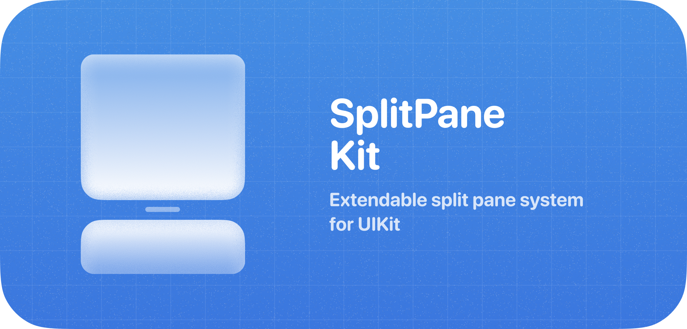
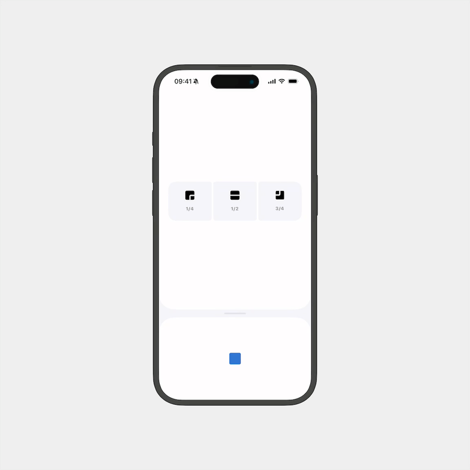

<p align="center">
  <!-- Add demo gif/image here -->
  
</p>

A flexible UIKit component for creating draggable split-pane interfaces with smooth animations and customizable breakpoints. Perfect for building adaptive layouts with resizable content areas, like email clients, file browsers, or any master-detail interface.

<p align="center">
  <!-- Add demo gif/image here -->
  
</p>

---

## 🚀 Installation

### Swift Package Manager

1. In Xcode, choose **File ▶ Add Packages…**
2. Enter this repository URL:
   ```
   https://github.com/jsmmth/SplitPaneKit.git
   ```
3. Click **Add Package**, select your target(s), and finish.

### Package.swift

If you manage dependencies via a manifest:

```swift
// swift-tools-version:5.9
import PackageDescription

let package = Package(
  name: "MyApp",
  platforms: [.iOS(.v13)],
  dependencies: [
    .package(url: "https://github.com/jsmmth/SplitPaneKit.git", from: "0.0.1"),
  ],
  targets: [
    .target(
      name: "MyApp",
      dependencies: [
        .product(name: "SplitPaneView", package: "SplitPaneView")
      ]
    )
  ]
)
```

Then in your code:

```swift
import SplitPaneKit
```

---

## 🎨 Core Concepts

### SplitPaneKit

The main container that manages two content panes with a draggable divider between them. The bottom pane can be dragged to different predefined heights (breakpoints).

```swift
// Create with default configuration
let splitPane = SplitPaneView()

// Or with custom configuration
let config = SplitPaneConfiguration(
    cornerRadius: 20,
    handleColor: .systemGray3,
    defaultBreakpoint: .half
)
let splitPane = SplitPaneView(configuration: config)
```

### SplitPaneContentView

Base class for content views that can be placed in either pane:

```swift
class MyContentView: SplitPaneContentView {
    override init(frame: CGRect) {
        super.init(frame: frame)
        // Setup your UI
    }

    // Optional: Provide a scroll view for dismissal handling
    override var dismissalHandlingScrollView: UIScrollView? {
        return myTableView
    }
}
```

### Breakpoints

Define the possible positions for the split divider:

```swift
// Use predefined breakpoints
splitPane.setBreakpoints([
    .quarter,      // 25% height
    .half,         // 50% height
    .threeQuarters // 75% height
])

// Or create custom breakpoints
let customBreakpoint = SplitPaneBreakpoint(ratio: 0.4, name: "custom")
splitPane.setBreakpoints([.quarter, customBreakpoint, .threeQuarters])
```

---

## 📱 Basic Usage

### Setting Up Content

```swift
class ViewController: UIViewController {
    override func viewDidLoad() {
        super.viewDidLoad()

        // Create split pane
        let splitPane = SplitPaneView()
        view.addSubview(splitPane)

        // Add constraints (full screen)
        splitPane.translatesAutoresizingMaskIntoConstraints = false
        NSLayoutConstraint.activate([
            splitPane.topAnchor.constraint(equalTo: view.topAnchor),
            splitPane.leadingAnchor.constraint(equalTo: view.leadingAnchor),
            splitPane.trailingAnchor.constraint(equalTo: view.trailingAnchor),
            splitPane.bottomAnchor.constraint(equalTo: view.bottomAnchor)
        ])

        // Set content views
        let topContent = MyTopContentView()
        let bottomContent = MyBottomContentView()

        splitPane.setTopPaneContent(topContent)
        splitPane.setBottomPaneContent(bottomContent)

        // Configure breakpoints
        splitPane.setBreakpoints([.quarter, .half, .threeQuarters])
    }
}
```

### Programmatic Control

```swift
// Transition to a specific breakpoint
splitPane.transitionTo(breakpoint: .half, animated: true)

// Get current position
let (progress, current, next) = splitPane.progressBetweenBreakpoints()
print("Progress: \(progress) between \(current?.name ?? "nil") and \(next?.name ?? "nil")")
```

### Responding to Changes

Implement the delegate to respond to user interactions:

```swift
class ViewController: UIViewController, SplitPaneViewDelegate {
    override func viewDidLoad() {
        super.viewDidLoad()
        splitPane.delegate = self
    }

    func splitPaneView(_ splitPaneView: SplitPaneView, didTransitionTo breakpoint: SplitPaneBreakpoint) {
        print("Transitioned to: \(breakpoint.name)")
    }

    func splitPaneView(_ splitPaneView: SplitPaneView, isDraggingWithTranslation translation: CGPoint, velocity: CGPoint) {
        // Respond to dragging if needed
    }
}
```

---

## 🎯 Advanced Features

### Pan Effecting Views

Create views that respond to pane height changes for coordinated animations:

```swift
class AnimatedHeaderView: UIView, SplitPanePanEffectingView {
    func splitPaneDidUpdateHeight(_ splitPane: SplitPaneView, height: CGFloat, progress: CGFloat, currentBreakpoint: SplitPaneBreakpoint?, nextBreakpoint: SplitPaneBreakpoint?) {
        // Animate based on height changes
        alpha = progress
        transform = CGAffineTransform(scaleX: 0.8 + (0.2 * progress), y: 0.8 + (0.2 * progress))
    }

    func splitPaneDidTransitionToBreakpoint(_ splitPane: SplitPaneView, breakpoint: SplitPaneBreakpoint) {
        // Final state after transition
        print("Settled at: \(breakpoint.name)")
    }
}

// Register the view
splitPane.addPanEffectingView(animatedHeader)
```

### Scroll View Integration

When using scroll views in the bottom pane, the split pane automatically handles the interaction between scrolling and dragging:

```swift
class BottomListView: SplitPaneContentView {
    private let tableView = UITableView()

    override var dismissalHandlingScrollView: UIScrollView? {
        return tableView // Enable drag-to-dismiss when at top of scroll
    }
}
```

---

## ⚙️ Configuration

Customize every aspect via `SplitPaneConfiguration`:

| Property                    | Description                                 | Default                             |
| --------------------------- | ------------------------------------------- | ----------------------------------- |
| `handleSize`                | Size of the drag handle                     | `CGSize(width: 56, height: 4)`      |
| `handleColor`               | Color of the drag handle                    | `.label.withAlphaComponent(0.08)`   |
| `handleSpacing`             | Space between panes                         | `20`                                |
| `cornerRadius`              | Corner radius of panes                      | `40`                                |
| `bottomPaneBackgroundColor` | Background color of bottom pane             | `.secondarySystemGroupedBackground` |
| `topPaneBackgroundColor`    | Background color of top pane                | `.secondarySystemGroupedBackground` |
| `animationSettings`         | Spring animation configuration              | `.default`                          |
| `topPaneShadow`             | Shadow configuration for top pane           | `.default`                          |
| `bottomPaneShadow`          | Shadow configuration for bottom pane        | `.default`                          |
| `dragThreshold`             | Minimum drag distance to trigger transition | `70`                                |
| `velocityThreshold`         | Minimum velocity to trigger transition      | `300`                               |
| `defaultBreakpoint`         | Initial breakpoint                          | `.quarter`                          |
| `rubberBandingStrength`     | Rubber banding effect strength (0-1)        | `0.7`                               |
| `hapticFeedbackStyle`       | Haptic feedback on transitions              | `.light`                            |

### Animation Settings

Fine-tune animations with `SplitPaneAnimationSettings`:

```swift
let fastAnimation = SplitPaneAnimationSettings(
    duration: 0.25,
    damping: 0.9,
    initialVelocity: 0.8
)

var config = SplitPaneConfiguration.default
config.animationSettings = fastAnimation
```

### Shadow Configuration

Add depth with `PaneShadowConfiguration`:

```swift
let shadow = PaneShadowConfiguration(
    color: .black,
    opacity: 0.15,
    radius: 12,
    offset: CGSize(width: 0, height: -2)
)

var config = SplitPaneConfiguration.default
config.bottomPaneShadow = shadow
config.topPaneShadow = .none // No shadow
```

---

## 🛠 Example Project

Check out the [Examples](./Examples) folder for complete working demos including:

- Basic split pane setup
- Custom animations with pan effecting views
